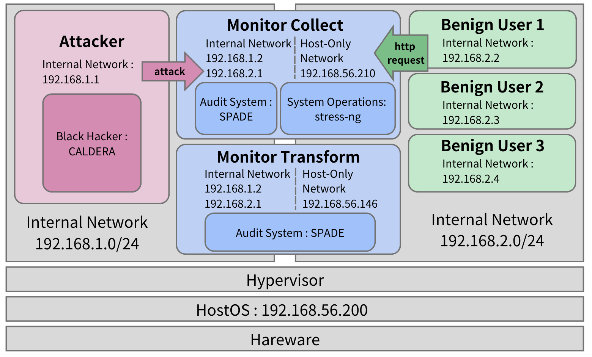
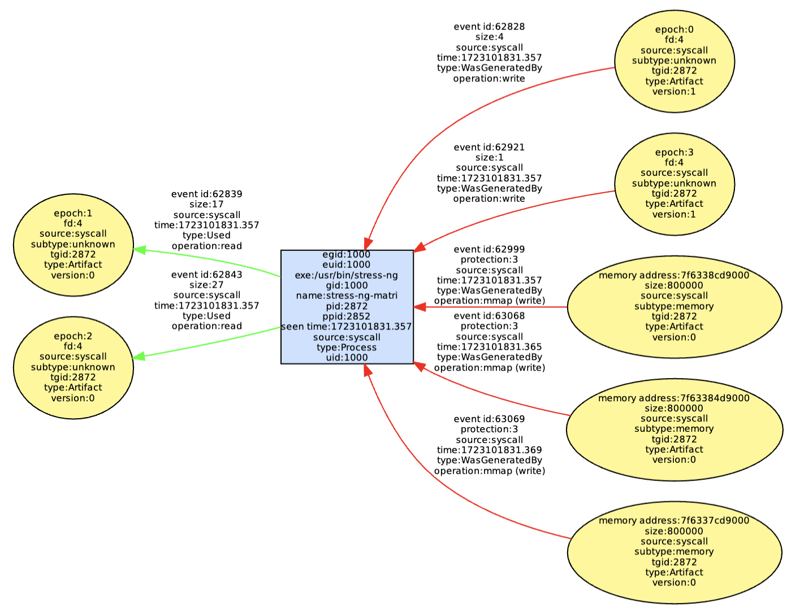
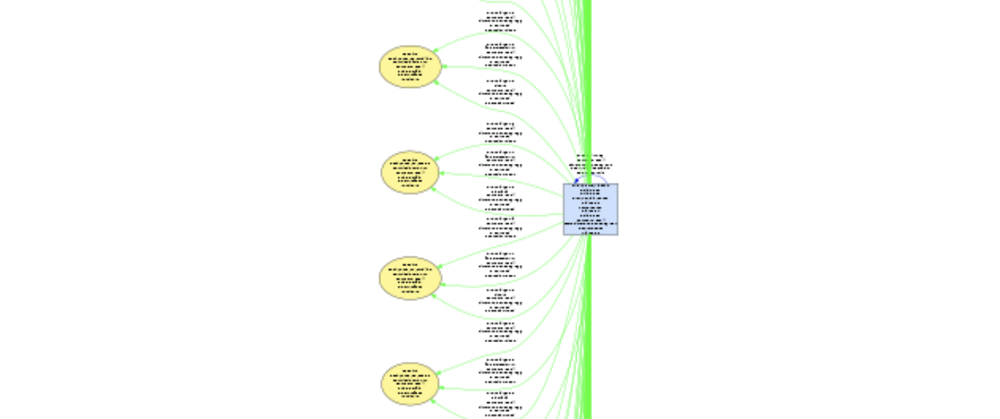

# Various Attack Scenario Generation
---
## Description

- **Motivation** : Many existing public intrusion datasets e.g. DARPA / ADFA are outdated and no longer representative of current environments. 
- **Idea** : In order to expand public intrution data, we hope to develop algorithm to form synthetic dataset that can increase the diversity of the data. 
- **Goal** : 
    1. Attack Workload: Record audit logs of system attacked by CALDERA $\Rightarrow$ Given the audit logs, turn them into provenance graphs. *(Complete)*
    2. Benign Workload: Record audit logs of benign workload simulated by stress-ng or http request $\Rightarrow$ Given the audit logs, turn them into provenance graphs. *(Complete)*
    3. Generate Synthetic Dataset *(To be done)*



## File Structure
<details>
  <summary><h4 style="display: inline;">File Structure</h4></summary>
    <pre><code>
    /VASG
    |-- READEME.md 
    |-- /VMs
    |       |-- Official_Server.ova
    |       |-- Benign_User.ova
    |       |-- Monitor_Collect.ova
    |       |-- Monitor_Transform.ova
    |-- /Attack
    |		|-- attack.py
    |		|-- /Collect+Filter
    |		|		|-- abilities_info.json  
    |		|		|-- log_filter.py   
    |		|		|-- ragdoll.py  
    |		|		|-- spade_collect.sh
    |		|		|-- monitor_host.sh 
    |		|-- /Transform
    |		|		|-- attack_transform.sh
    |		|-- /Results
    |				|-- /spade
    |				|-- /logs
    |				|-- /graphs
    |				|-- /json
    |--/Benign
    |		|-- benign.py
    |		|-- /Collect+Filter
    |			|-- benign_collect.py
    |			|-- filter_stress-ng.py
    |			|-- spade_collect.sh
    |			|-- stress-ng.py
    |		|-- /Transform
    |			|-- benign_transform.py
    |			|-- benign_transform.sh
    |			|-- graph_transform.py
    |			|-- move.py
    |		|-- /Results
    |				|-- /logs
    |				|-- /graphs
    |				|-- /json
    |				|-- /debug_info
    |				|		|-- auto_log (benign_collect.py)
    |				|		|-- stressng_final_result (graph_transform.py)
    |				|		|-- success_tasks (graph_transform.py)
    |				|-- /filtered_logs
    |--/shared
            |-- /task
                |-- cpu-cache.task
                |...
                |-- vm.task
            |-- collect_error_log (stress-ng.py)
            |-- transform_error_log (benign_transform.py)
    </code></pre>
</details>

#### File Description
- **VASG** : 
    - `READEME.md` 
    - **VMs** : ova files to be imported into VirtualBox
        - `Offical_Server.ova` : Black Hacker VM
        - `Benign_User.ova` : Benign User VM 
        - `Monitor_Collect.ova` : Monitor Host VM for collecting audit logs
        - `Monitor_Transform.ova` : Monitor Host VM for transforming audit logs into provenance graph
    - **Attack** 
        - `attack.py` : runs attack workload (can either run all TTPs or specify one TTP via its ability_id)
        - **Collect+Filter**
            - `abilities_info.json` : information of each attack in CALDERA
            - `monitor_host.sh` : runs `ragdoll.py` + create pid file
            - `ragdoll.py` : connects to CALDERA and send exploit
            - `spade_collect.sh` : add reporter Audit in SPADE
                > this shell script is run in crontab of ***spade*** user.
            - `log_filter.py` : filters audit.log (whole system log) to filtered.log (attack log only)
        - **Transform** 
            - `attack_transform.sh` : transform filtered.log to provenance.json and graph.dot 
        - **Results**
            - **spade**
                - `processed.json` : successful attacks
                - `toSkip.json` : failed at retrieving files
                - `transformError.json` : nothing in JSON file
            - **logs** : stores filtered logs of each attack
            - **graphs** : stores provenance graph of each attack
            - **json** : stores json format of each attack
    - **Benign**
        - `benign.py` : runs benign workload
        - **Collect+Filter**
            - `spade_collect.sh` : add reporter Audit in SPADE
                > this shell is run in crontab of ***spade*** user
            - `benign_collect.py` : runs the whole collection process of benign workload
            - `stress-ng.py` : record audit logs 
            - `filter_stress-ng.py` : system audit logs $\to$ per task filtered logs

            
        - **Transform**
            - `benign_transform.py` : runs the whole transformation process of benign workload
            - `benign_transform.sh` : set up SPADE $\to$ transform $\to$ turn off 
            - `move.py` : move .json and .dot to the corresponding folder
            - `graph_transform.py` : transform .dot into provenance graph
            
        - **Results**
            - **filtered_logs** : stores filtered logs of each class
            - **logs** : stores filtered logs of each task
            - **graphs** : stores provenance graph of each task
            - **json** : stores json format of each task
            - **debug_info** 
                - `auto_log` : result of `benign_collect.py`
                - `stressng_final_result` : result of `graph_transform.py`
                - `success_tasks` : result of `graph_transform.py`
            
    - **shared** 
        - **task** : tasks of each class
        - `collect_error_log` : result of `stress-ng.py`
        - `transform_error_log` : result of `benign_transform.py`
            > `Success!` : successfully generated .dot and .json files.
            > `[!] Processing JSON failed : no data in json` : failed to `add reporter Audit`
            

## Requirements
> ❗The below requirements are already set up inside given VMs. 
> You don't have to re-install again.

- **Monitor Host** (Monitor_Collect & Monitor_Transform)
    - [SPADE](https://github.com/ashish-gehani/SPADE): This is the tool that can convert the logs recorded by Linux Audit System to provenance graph.
    Just strictly follow the document then you can setup SPADE.

    - [stress-ng](https://github.com/ColinIanKing/stress-ng) : this is the tool that simulates system operations.
        ```
        sudo apt install wget build-essential
        wget https://github.com/ColinIanKing/stress-ng/tarball/V0.18.01 -O stress-ng-0.18.01.tar.gz
        tar -xvf stress-ng-0.18.01.tar.gz
        cd ColinIanKing-stress-ng-*
        make
        sudo make install
        ```
        > ❗Cannot use `sudo apt install stress-ng` because the version is too old. 
        > (Ubuntu version on VM is 22.04, corresponding stress-ng version is 0.13.12; However, we need 0.18.01 to run some of the stress-ng commands)

    - **Plugins**
        ```
        sudo apt update
        sudo apt install vim git wget curl python3 python3-pip auditd golang screen apparmor openssh-server
        sudo systemctl start ssh
        sudo systemctl enable ssh
        sudo pip3 install --upgrade pip
        sudo pip3 install beautifulsoup4 requests flask psutil
        echo 'export PATH=$PATH:/home/{vm name}/.local/bin' >> ~/.bashrc && source~/.bashrc
        ```
    


- **Black Hacker** (Official_Server)
    - [MITRE Caldera](https://github.com/mitre/caldera): an automated adversary emulation system which can replicate real-world attack scenarios.
        ```
        git clone https://github.com/mitre/caldera.git --recursive
        cd caldera
        pip3 install -r requirements.txt
        ```
    - **Plugins**
        ```
        sudo apt update
        sudo apt install golang vim git python3-pip
        ```


## Setup & Execution Steps

- **VM Information** 
    > ❗ For network setup : 
    > **The same internal network should have the same name.** Even with the same IP, the internal networks are distinct if their names are different.

    - **Monitor Host - Monitor_Collect & Monitor_Transform :**
        > Monitor_Collect : SPADE will collect audit logs.
        > Monitor_Transform : SPADE will transform filtered logs to provenance graph.

       - Accounts:
            ```
            User: root
            Password: root

            User: spade
            Password: spade

            User: victim1
            Password: victim1

            su: root
            ```

        - Network:
            > three network interface cards
            ```
            Adapter 1: NAT (for set-up)

            Adapter 2: Internal Network
            IP: 192.168.1.2 with Black Hacker
                192.168.2.1 with Benign User

            Adapter 3: Host Only 
            IP: 192.168.56.210 for Monitor_Collect
                192.168.56.146 for Monitor_Transform
            ```

    - **Black Hacker - Official_Server :**
        > Caldera is installed on this vm.
        
        - Account:
            ```
            User: server
            Password: server
            ```
        - Network:
            two network interface cards
            ```
            Adapter 1: Host Only
            IP: 192.168.56.200

            Adapter 2: Internal Network 
            IP: 192.168.1.1 with Monitor_Collect (Monitor_Transform does not need to connect to Official_Server)
            ``` 

    - **Benign User - Benign_User :**
        > This VM will send http requests to Monitor_Collect. Not yet implemented.

- **VM setup:**
    1. **Import virtual machines**
        - **Files** -> **Import Appliance** -> **File**: Choose the VM's `.ova` file -> **Machine Base Folder**: Import to your own place
   
    2. **Change shared folder path**
        - Select machine -> **Settings** -> **Shared Folders** -> Select folder named **'shared'** in your own server
        - Ensure the permission of the shared folder is `777` or change the owner

    3. **Take a snapshot**
        - Select machine -> **Snapshot** -> **Take**

- **Execution Steps:**
    - Record audit logs + Transform to graphs : 
        ```
        -----------------------
        | run attack workload | 
        -----------------------
        # run all TTPs
        python3 ./VASG/Attack/attack.py --all

        # run specified TTP via its ability_id
        python3 ./VASG/Attack/attack.py --specify <ability_id>
        
        -----------------------
        | run benign workload |
        -----------------------
        # run all classes
        python3 ./VASG/Benign/benign.py --all

        # run specified class via its class name
        python3 ./VASG/Benign/benign.py --specify <class_name>
        ```

## Simple Result / Unit Test

All results are stored in the `Results` folder. Including : logs, graphs, json.

- **Benign** : This is the result of running `python3 benign.py --specify cpu`. Only the result for task `3d` is shown for demonstration.
    - **logs**
        The below is only a fragment. The full document is at `/VASG/Benign/Results/logs/cpu/3d.log`.
        ```
        node=MonitorHost type=SYSCALL msg=audit(1724301255.996:62499): arch=c000003e syscall=257 success=yes exit=4 a0=ffffff9c a1=55cfac029a05 a2=1 a3=0 items=1 ppid=2902 pid=2927 auid=0 uid=0 gid=0 euid=0 suid=0 fsuid=0 egid=0 sgid=0 fsgid=0 tty=pts1 ses=5 comm="stress-ng-matri" exe="/usr/bin/stress-ng" key=(null)
        node=MonitorHost type=SYSCALL msg=audit(1724301255.996:62500): arch=c000003e syscall=1 success=yes exit=4 a0=4 a1=55cfac029a00 a2=4 a3=0 items=0 ppid=2902 pid=2927 auid=0 uid=0 gid=0 euid=0 suid=0 fsuid=0 egid=0 sgid=0 fsgid=0 tty=pts1 ses=5 comm="stress-ng-matri" exe="/usr/bin/stress-ng" key=(null)
        node=MonitorHost type=SYSCALL msg=audit(1724301255.996:62501): arch=c000003e syscall=3 success=yes exit=0 a0=4 a1=55cfac029a00 a2=4 a3=0 items=0 ppid=2902 pid=2927 auid=0 uid=0 gid=0 euid=0 suid=0 fsuid=0 egid=0 sgid=0 fsgid=0 tty=pts1 ses=5 comm="stress-ng-matri" exe="/usr/bin/stress-ng" key=(null)
        node=MonitorHost type=SYSCALL msg=audit(1724301255.996:62502): arch=c000003e syscall=257 success=yes exit=4 a0=ffffff9c a1=55cfac029d60 a2=0 a3=0 items=1 ppid=2902 pid=2927 auid=0 uid=0 gid=0 euid=0 suid=0 fsuid=0 egid=0 sgid=0 fsgid=0 tty=pts1 ses=5 comm="stress-ng-matri" exe="/usr/bin/stress-ng" key=(null)
        ```
    - **graphs** 
        
        
    - **json** 
        The below is only a fragment. The full document is at `/VASG/Benign/Results/json/cpu/3d.json`.
        ```
        [
        {"annotations":{"uid":"0","egid":"0","exe":"/usr/bin/stress-ng","gid":"0","euid":"0","name":"stress-ng-merge","pid":"2874","seen time":"1724301563.648","source":"syscall","ppid":"2859"},"id":"4581e2d3f9029516035b6b529dccdac8","type":"Process"}
        ,{"annotations":{"memory address":"7fcc7fd3d000","size":"100000","subtype":"memory","tgid":"2874","source":"syscall","version":"0"},"id":"605c69c3e3b278b4a4a730753ab3ade5","type":"Artifact"}
        ...
        ]
        ```
- **Attack** :
    - **logs**
        The below is only a fragment of T1014_dynamic-linker based rootkit (libprocesshider).log.
        ```
        node=MonitorHost type=SYSCALL msg=audit(1721148779.776:1758): arch=c000003e syscall=3 success=yes exit=0 a0=3 a1=ffffffff a2=9cd180 a3=7fc06e29f748 items=0 ppid=2484 pid=2486 auid=1000 uid=1000 gid=1000 euid=1000 suid=1000 fsuid=1000 egid=1000 sgid=1000 fsgid=1000 tty=(none) ses=1 comm="python3" exe="/usr/bin/python3.6" key=(null)
        node=MonitorHost type=PROCTITLE msg=audit(1721148779.776:1758): proctitle=707974686F6E33002F686F6D652F76696374696D312F726167646F6C6C2E7079002D5700687474703A2F2F3139322E3136382E312E313A383838382F77656174686572
        node=MonitorHost type=SYSCALL msg=audit(1721148779.776:1759): arch=c000003e syscall=3 success=yes exit=0 a0=5 a1=ffffffff a2=9cd180 a3=7fc06e29f748 items=0 ppid=2484 pid=2486 auid=1000 uid=1000 gid=1000 euid=1000 suid=1000 fsuid=1000 egi
        ```
    - **graphs**
        The below is only a fragment of T1014_dynamic-linker based rootkit (libprocesshider).png.
        
    - **json** 
        The below is only a fragment of T1014_dynamic-linker based rootkit (libprocesshider).json.
        ```
        [
        {"annotations":{"cwd":"/home/victim1","uid":"1000","egid":"1000","exe":"/usr/bin/python3.6","gid":"1000","euid":"1000","name":"python3","pid":"2486","seen time":"1721148779.776","source":"syscall","ppid":"2484"},"id":"b96de1d241e96ca867b6dec4e33ad584","type":"Process"}
        ,{"annotations":{"path":"/proc/2486/fd","subtype":"directory","permissions":"0500","epoch":"0","source":"syscall","version":"0"},"id":"d2fe60e6d03896d93dd827dfa111bfa1","type":"Artifact"}
        ,{"annotations":{"event id":"1761","flags":"O_RDONLY","source":"syscall","time":"1721148779.776","operation":"open"},"from":"b96de1d241e96ca867b6dec4e33ad584","to":"d2fe60e6d03896d93dd827dfa111bfa1","type":"Used"}
        ...
        ]
        ```

## Additional Information

- **Some Warnings about Installing SPADE**
    - SPADE won't record events related to the user executing it, so you need to create a user. Here, it is user `spade`.
    - When you want to use reporter and storage, there is a strict ordering of the commands.
        ```
        add storage -> add reporter -> remove reporter -> remove storage
        ```
        > ❗ If you add reporter first, the events occur before you add storage would be discarded.
        > ❗ If you remove storage first, nothing would be recorded (I don't know why and this is not mentioned in the document)

- Don't interrupt `automation.py` while it is running, otherwise, the VM may break. Please **power off the machine before** interrupting `automation.py`.

- When static IP is set, NAT will no longer work. To use NAT, you have to :
    ```
    cd /etc/netplan
    rm 01*
    sudo netplan apply
    reboot
    ```
    > When executing `sudo netplan apply`, all config files under `/etc/netplan` will be configured. 
    > To check network configurations, use `ifconfig`.

## Troubleshooting
- **Benign** : Some classes may *fail to ssh*. When this happens, *rerun* those classes again.